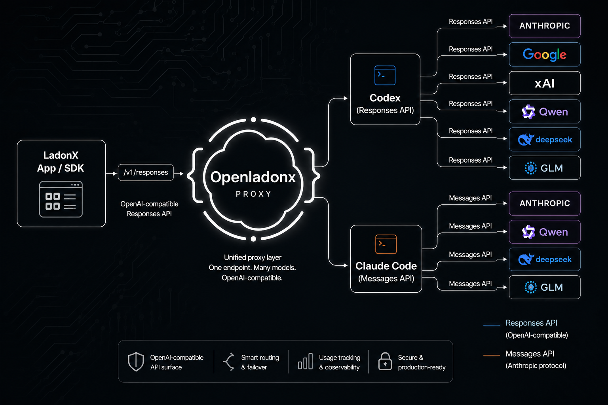

# OpenLadonx

[English](README.md) | [简体中文](README.zh-CN.md)


OpenLadonx is an open desktop workspace for modern AI coding agents. It brings Codex-style and Claude Code-style workflows into one native Tauri app: chat threads, workspace context, git review, terminals, model routing, skills, plugins, MCP server status, and local desktop integrations.

Codex and Claude Code both offer powerful agent experiences, but their official desktop clients are closed-source. OpenLadonx takes a different path: it integrates the desktop-side workflow patterns developers already like, opens most of the implementation, and gives builders a real codebase they can study, modify, fork, and reshape into the agent desktop they actually want.

Use the built-in provider path, or connect your own OpenAI Responses-compatible and Anthropic Messages-compatible model endpoints. OpenLadonx is designed for developers, teams, and agent tinkerers who want a local-first command center instead of another locked-down black box or browser tab.



## What OpenLadonx Does

OpenLadonx turns the desktop client itself into something developers can own. Instead of treating the agent UI as a sealed product, it exposes the practical building blocks behind a serious AI coding workspace: model connections, prompt and instruction surfaces, local workspace awareness, terminal access, git context, plugin state, MCP visibility, and native app integration.

- **Unifies agent workflows** for Codex-style and Claude Code-style development in a single desktop app.
- **Opens the desktop layer** so developers can inspect, fork, and rebuild the parts of the agent experience that are usually hidden inside closed-source clients.
- **Connects your own models** through OpenAI Responses-compatible `/v1/responses` endpoints or Anthropic Messages-compatible `/v1/messages` endpoints.
- **Keeps real work close** with conversations, workspaces, files, terminals, diffs, branches, issues, and pull requests in one native surface.
- **Makes extension first-class** with skills, plugins, prompts, MCP tool-call rendering, and workspace `AGENTS.md` editing.
- **Gives local configuration control** for model credentials, Codex `config.toml`, plugin state, MCP status, and desktop settings.

If you are building an internal agent platform, experimenting with custom models, designing a new coding-agent UX, or just tired of waiting for closed desktop clients to expose the one feature you need, OpenLadonx is meant to be a strong starting point.

## Model Routing

OpenLadonx supports two custom API protocol families from Settings:

| Protocol | Endpoint style | Typical use |
| --- | --- | --- |
| `OpenAI/Response` | `/v1/responses` | OpenAI Responses-compatible providers, routers, and proxy layers. |
| `Anthropic/Messages` | `/v1/messages` | Anthropic Messages-compatible providers, routers, and Claude-style model surfaces. |

To add a model:

1. Open **Settings**.
2. Go to the model/API key section.
3. Click **Add model**.
4. Choose `OpenAI/Response` or `Anthropic/Messages`.
5. Enter the base URL, API key, and one or more model IDs.
6. Run the built-in test request.
7. Save the configuration. The models will appear in the model selector.

Custom model settings are stored locally. Do not commit API keys, local auth files, generated config, or machine-specific signing settings.

## Quick Start

Install dependencies:

```sh
npm install
```

Run the frontend only:

```sh
npm run dev
```

Launch the full Tauri desktop app:

```sh
npm run tauri:dev
```

Run the strict environment check before desktop builds:

```sh
npm run doctor:strict
```

## Development Commands

```sh
npm run build
npm run lint
npm run test
npm run typecheck
cargo check --manifest-path src-tauri/Cargo.toml
```

For focused Rust/Tauri validation:

```sh
cd src-tauri
cargo check
cargo test
```

## Feature Surface

- Workspace-aware chat threads with file references and token-aware autocomplete.
- File previews, terminal panes, branch helpers, git diffs, and PR-oriented review context.
- Model/API key management for compatible Responses and Messages endpoints.
- Skills, plugins, prompt management, and MCP server status surfaces.
- Local editors for global and workspace-level `AGENTS.md` instructions.
- Codex `config.toml` editing from the desktop UI.
- Multi-language UI assets and English/Chinese README documentation.

## Project Layout

```text
.
├── public/              # Static web assets
├── src/                 # React application code
│   ├── features/        # Feature modules
│   ├── hooks/           # Shared React hooks
│   ├── services/        # App and Tauri service clients
│   ├── styles/          # Global and design-system styles
│   ├── test/            # Vitest setup
│   └── utils/           # Shared helpers
├── src-tauri/           # Tauri configuration and Rust code
│   ├── src/             # Rust commands, services, and app wiring
│   └── tests/           # Rust integration tests
├── scripts/             # Build, doctor, release, and maintenance scripts
└── docs/                # Project documentation and static docs site
```

## Prerequisites

- Node.js and npm.
- Rust toolchain with Cargo.
- Tauri system dependencies for your platform.
- A model credential from a supported default provider, or a compatible custom endpoint.

## Configuration

OpenLadonx reads and writes local desktop settings, Codex configuration, and workspace instruction files. Typical local configuration includes:

- API keys and base URLs.
- Custom Responses API and Messages API model lists.
- Global and workspace `AGENTS.md` instructions.
- Codex `config.toml` content.
- Plugin enablement and MCP configuration managed by the underlying agent environment.

For Anthropic-compatible providers, add a model from Settings with the `Anthropic/Messages` protocol. Use a base URL that exposes a Messages-compatible `/v1/messages` endpoint, enter the provider API key, and list the model IDs you want to show in the selector, such as Claude-family models or compatible router model names. OpenLadonx keeps this configuration local so you can switch between official Anthropic access, private gateways, and third-party compatible providers without changing the app code.

The repository includes `.testflight.local.env.example` as a reference for local release configuration. Copy it to an ignored local file when needed.

## Contributing

- Use 2-space indentation for TypeScript and TSX.
- Name React components in `PascalCase`, hooks as `useSomething`, utilities in `camelCase`, and Rust functions in `snake_case`.
- Prefer configured aliases such as `@/`, `@app/`, `@services/`, and `@utils/`.
- Keep frontend IPC contracts aligned with Rust Tauri commands and payload types.
- Add focused tests near the feature or module you change.
- Run `npm run typecheck`, `npm run lint`, and relevant tests before opening a pull request.

## License

This project is licensed under the terms in [LICENSE](LICENSE).
